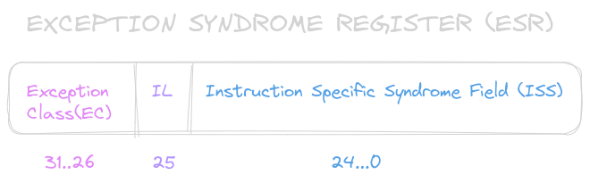

## Ejercicio 9
Suponga que el registro X9 contiene el Exception Syndrome Register (ESR). Dé una secuencia mínima de instrucciones LEGv8 para poner en X10 el número que codifica la clase de excepción Exception Class (EC).



```
LSR X10, X9, #26
``` 