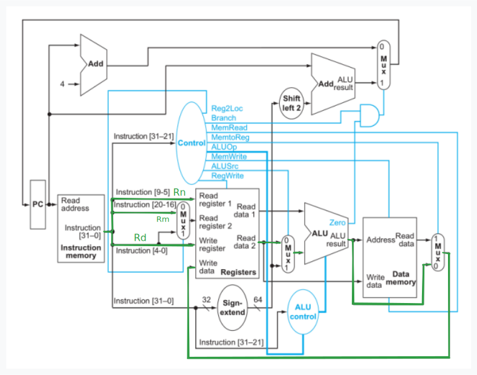

## Ejercicio 3
Completar la tabla con el estado de las señales. 
Indicar con X las condiciones no-importa.

| Instr. | Reg2Loc | ALUSrc | MemtoReg | RegWrite | MemRead | MemWrite | Branch | ALUop1 | ALUop0 | ALUop |
|:-------|:-------:|:------:|:--------:|:--------:|:-------:|:--------:|:------:|:------:|:------:|:-----:|
| **Tipo R** | | | | | | | | | | 10 |
| **LDUR**   | | | | | | | | | | 00 |
| **STUR**   | | | | | | | | | | 00 |
| **CBZ**    | | | | | | | | | | 01 |

 
 
 

| Instr. | Reg2Loc | ALUSrc | MemtoReg | RegWrite | MemRead | MemWrite | Branch | ALUop1 | ALUop0 |
|:-------|:-------:|:------:|:--------:|:--------:|:-------:|:--------:|:------:|:------:|:------:|
| **Tipo R** |  0  |   0    |    0     |    1     |    0    |    0     |    0   |   1    |   0    |

 
 
 

| Instr. | Reg2Loc | ALUSrc | MemtoReg | RegWrite | MemRead | MemWrite | Branch | ALUop1 | ALUop0 |
|:-------|:-------:|:------:|:--------:|:--------:|:-------:|:--------:|:------:|:------:|:------:|
| **LDUR** |   x   |   1    |    1     |    1     |    1    |    0     |    0   |   0    |   0    |

 
 
 

| Instr. | Reg2Loc | ALUSrc | MemtoReg | RegWrite | MemRead | MemWrite | Branch | ALUop1 | ALUop0 |
|:-------|:-------:|:------:|:--------:|:--------:|:-------:|:--------:|:------:|:------:|:------:|
| **STUR** |   1   |   1    |    x     |    0     |    0    |    1     |   0    |   0    |   0    |

 
 
 

| Instr. | Reg2Loc | ALUSrc | MemtoReg | RegWrite | MemRead | MemWrite | Branch | ALUop1 | ALUop0 |
|:-------|:-------:|:------:|:--------:|:--------:|:-------:|:--------:|:------:|:------:|:------:|
| **CBZ**|    1    |   0    |    x     |    0     |    0    |    0     |   1    |   0    |   1    |

 
 
 

Entonces, la tabla queda de la siguiente manera:
| Instr. | Reg2Loc | ALUSrc | MemtoReg | RegWrite | MemRead | MemWrite | Branch | ALUop1 | ALUop0 |
|:-------|:-------:|:------:|:--------:|:--------:|:-------:|:--------:|:------:|:------:|:------:|
| **Tipo R** |  0  |   0    |    0     |    1     |    0    |    0     |    0   |   1    |   0    |
| **LDUR** |   x   |   1    |    1     |    1     |    1    |    0     |    0   |   0    |   0    |
| **STUR** |   1   |   1    |    x     |    0     |    0    |    1     |    0   |   0    |   0    |
| **CBZ**|    1    |   0    |    x     |    0     |    0    |    0     |    1   |   0    |   1    |
