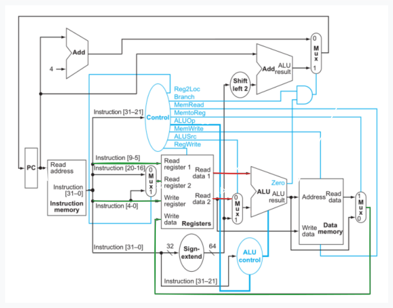

## Ejercicio 6
En este ejercicio analizaremos en detalle cómo se ejecuta una instrucción en el single-cycle datapath, asumiendo que la palabra de instrucción que ejecuta el procesador es: 0xf8014062, dado que PC=0x100.

6.1) Cuáles son las salidas de los bloques *Sign-extend* y *Shift left 2* para esta palabra de instrucción?
```
Primero veamos cuál es la instrucción 0xf8014062

0xf8014062 = 11111000000000010100000001100010b

opcode:    111 1100 0000 = 0x7C0 => stur
DT_adress: 000010100             => 20  
op:        00
Rn:        00011                 => x3
Rt:        00010                 => x2

La operación es stur x2, [x3, #20]
```


```
Por lo tanto, la salida de Sign-extend es 20, y la de Shift left 2 es 80
```

<br><br><br>

6.2) Cuáles son los valores de entrada a la unidad ALU control para esta palabra de instrucción?
```
00, que siempre es la misma para ldur y stur
```

<br><br><br>

6.3) Cuál es la nueva dirección en el PC después de ejecutar esta instrucción?


```
0x104
```

<br><br><br>

6.4) Mostrar los valores de las entradas y salidas de cada Mux durante la ejecución de esta instrucción. Para los valores que son salidas de Registers, utilizar “Reg[Xn]”.


<br><br><br>

6.5) Cuáles son los valores de entrada de la ALU y las dos unidades Add?


<br><br><br>

6.6) Cuáles son los valores de todas las entradas del bloque Registers?

