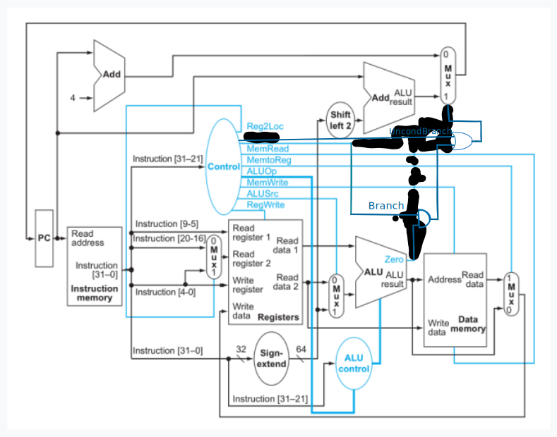

## Ejercicio 7
Agregar a la implementación de la ISA la instrucción de **salto incondicional** B, a partir de una nueva señal que sale de *Control*, *denominada UncondBranch*.

- Sign-extend: debe reconocer el opcode de la instrucción B, tomar el campo de inmediato (los 25 bits menos significativos) y extender el signo (replicar 36 veces el bit 25).
- Control: debe decodificar el opcode de B y generar la señal de control “Uncondbranch”, que tomará valor ‘1’ en caso de ejecutar la instrucción B y ‘0’ en cualquier otro caso.

| Reg2Loc | ALUSrc | MemtoReg | RegWrite | MemRead | MemWrite | Branch | ALUop1 | ALUop0 | UncondBranch |
|:-------:|:------:|:--------:|:--------:|:-------:|:--------:|:------:|:------:|:------:|:------------:|
|    x    |   x    |    x     |    0     |    0    |    0     |    0   |   x    |   x    |      1       |