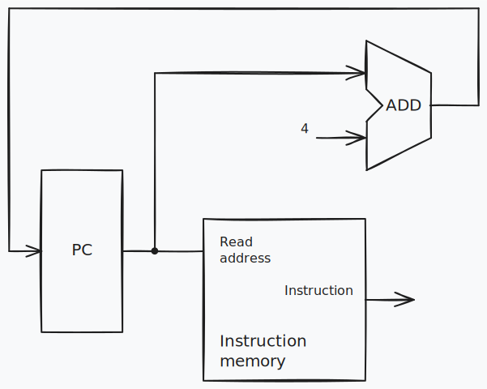

## Ejercicio 8
Suponiendo que los diferentes bloques dentro del procesador tienen las siguientes **latencias**:

| I-Mem / D-Mem | Register File | Mux   | ALU    | Adder  | Single gate | Register Read | Register Setup | Sign extend | Control | Sl2   |
|:-------------:|:-------------:|:-----:|:------:|:------:|:-----------:|:-------------:|:--------------:|:-----------:|:-------:|:-----:|
|    250 ps     |    150 ps     | 25 ps | 200 ps | 150 ps |    5 ps     |     30 ps     |     20 ps      |    50 ps    |  50 ps  | 25 ps |

8.1) Cuál es la latencia si lo único que tuviera que hacer el procesador es fetch de instrucciones consecutivas?

**Latencia de fetch** = RegRead + Imem = 30 + 250 = **280ps**



- Register read: tiempo posterior al flanco ascendente de reloj, necesario para que el nuevo valor de registro aparezca en la salida. Este valor se aplica sólo al PC.
- Register setup: tiempo que la entrada de datos de un registro debe permanecer estable antes del flanco ascendente de reloj. Este valor se aplica tanto al PC como al Register File.

<br><br><br>

8.2) Hay un modo alternativo de generar la señal Reg2Loc fácilmente de la instrucción sin tener que esperar la latencia de Control. Explicar cómo sería.
```
El bit 28 de las instrucciones contiene el valor correcto para la línea de control Reg2Loc
```

<br><br><br>

8.3) Cuál es la latencia si solo hubiera instrucciones de tipo R?
```
Latencia de una instrucción tipo R = RegRead + I-Mem + Control + Mux + RegFile + Mux + ALU + Mux + RegSetup<br>
                                   = 30 + 250 + 50 + 25 + 150 + 25 + 200 + 25 + 20
                                   = 775ps
```

<br><br><br>

8.4) Cuál es la latencia para LDUR?
```
Latencia de la instrucción LDUR = Register Read + I-Mem + Register File + ALU + D-Mem + Mux + Register Setup
                                = 30 + 250 + 150 + 200 + 250 + 25 + 20
                                = 925ps
```

<br><br><br>

8.5) Cuál es la latencia para STUR?
```
Latencia de la instrucción STUR = Register Read + I-Mem + Control + Mux + Adder + ALU + D-Mem
                                = 30 + 250 + 50 + 25 + 150 + 200 + 250
                                = 955ps
```

<br><br><br>

8.6) Cuál es la latencia para CBZ?
```
Latencia de la instrucción CBZ = Register Read + I-Mem + Control + Mux + Register File + Mux + ALU + Gate + Mux + Register Setup
                               = 30 + 250 + 50 + 25 + 150 + 25 + 200 + 5 + 25 + 20
                               = 780ps
```

<br><br><br>

8.7) Cuál es el mínimo periodo de reloj para esta implementación de la ISA? Indicar también la frecuencia de reloj correspondiente (f = 1/t).
```
Para que todas las instrucciones puedan ejecutarse completamente el periodo de reloj
debe ser mayor o iguala la latencia de instrucción más grande. En este caso,
corresponde a la latencia de STUR.
Mínimo periodo de reloj para esta implementación de la ISA (t) = 955ps = 955e-12s

Se calcula la frecuencia como la inversa del periodo.
Máxima frecuencia de reloj (f) = 1/t ≈ 1.047 GHz
```