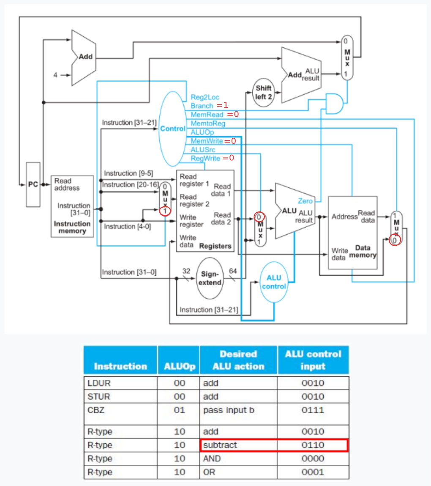

## Ejercicio 11
Al implementar los circuitos Control, ALU control se utilizaron muchas condiciones no-importa para simplificar la lógica. Esto produce efectos laterales. Cuando Instruction[31:21] está en el rango 0x5B8-0x5BF, obtenemos del Control:

| Reg2Loc | ALUSrc | MemtoReg | RegWrite | MemRead | MemWrite | Branch | ALUop1 | ALUop0 |
|:-------:|:------:|:--------:|:--------:|:-------:|:--------:|:------:|:------:|:------:|
|    1    |   0    |    0     |    0     |    0    |    0     |   1    |   1    |   1    |

Mientras que de ALU control tiene una implementación utilizando condiciones no importa que produce:

| ALUop1 | ALUop0 | I[31:21] | Operation |
|:------:|:------:|:--------:|:---------:|
|   1    |   1    |  0x5B8   |   0110    |
|   ⋮   |   ⋮    |    ⋮    |    ⋮     |
|   1    |   1    |  0x5BF   |   0110    |

Este es un típico caso de [instrucción no documentada](https://en.wikipedia.org/wiki/Halt_and_Catch_Fire_(computing)) con un comportamiento no del todo claro. Si, además, en el módulo Sign-extend esta instrucción se interpreta como un formato CB, indicar que hace esta instrucción, asignarle un mnemónico y describir la operación, a fin de completar la fila correspondiente a la nueva instrucción en la *green card*.

- 0x5B8-0x5BF es un opcode no usado en LEGv8.
- No se escriben registros ni la memoria de datos.
- Se leen 2 registros, ambos entran a la ALU y se hace la resta entre ellos.
- Si la resta da cero (si R1 = R2), como Branch = 1, salta a lo que haya en Sign-extend con Sl2 + PC.
- Como Reg2Loc = 1, los bits 9-5 se utilizan para direccionar el segundo registro. Dado que en el módulo Sign-extend esta instrucción se interpreta como un formato CB, esos bits también se utilizan como parte del campo “COND_BR_address” para calcular el desplazamiento del branch.

- Operación realizada: compara y salta si el registro 1 es igual al registro 2.
- Mnemónico propuesto: CBEQ